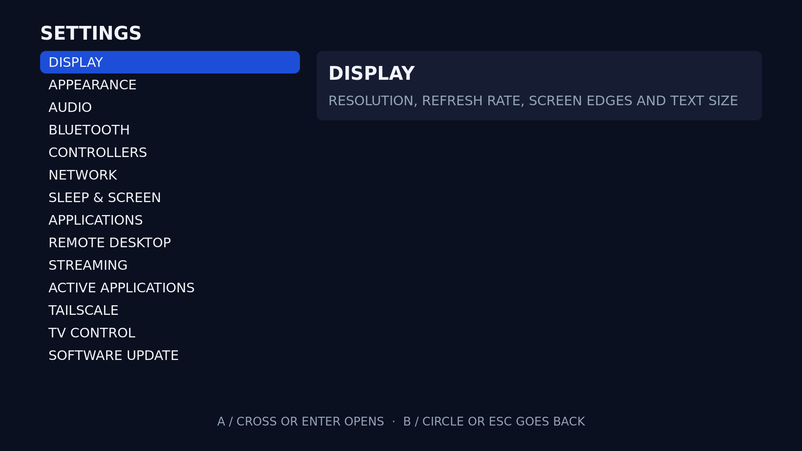
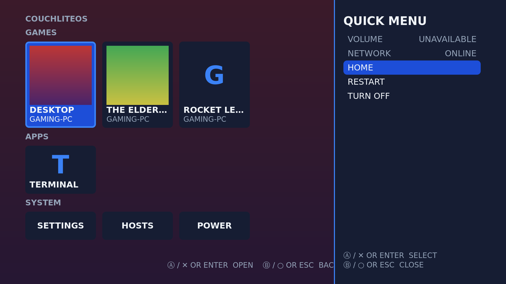

# CouchLiteOS

CouchLiteOS turns an old PC into a game-streaming box for the TV. It starts
straight into a simple full-screen menu you drive with a controller or a TV
remote, and runs Moonlight, chiaki-ng, Firefox, Google Chrome and Remote Desktop.
It is built on Debian 13 and is not a general-purpose desktop.

**[Download the latest release](https://github.com/Dudiebug/couchliteos/releases/latest)** ·
**[User guide (wiki)](https://github.com/Dudiebug/couchliteos/wiki)** ·
**[Report a bug](https://github.com/Dudiebug/couchliteos/issues/new/choose)**

(Formerly MoonlightOS.)

## What it does

- **Stream PC games** with Moonlight from a Sunshine host, and PlayStation games
  with chiaki-ng.
- **A TV interface:** your games first, most recently played at the front, with
  their covers; then your apps. A bar along the bottom always shows what each
  button and key does, and small notices tell you when a controller connects,
  the gaming PC comes online or an update is ready. Game covers come from
  Moonlight or are looked up by name; hold Y / Square on a game to pick another.
- **A quick menu over any app:** tap Guide / PS (or Home on a keyboard) for
  volume, brightness, controller batteries, network, sleep, restart and turn
  off. During a stream Guide and the PlayStation touchpad go to the gaming PC;
  hold Select+Start (View+Menu) to come back.
- **Per-game stream settings:** hold X / Triangle on a game to pick
  PERFORMANCE, BALANCED, QUALITY or your own resolution, frame rate and bitrate
  for that game alone.
- **Themes:** four built in (including a light one and a high-contrast one),
  eight accent colours, and [your own](docs/THEMES.md).
- **Couch-first controls:** every screen works with an Xbox, PlayStation,
  Nintendo-style or generic controller, a keyboard, or the TV remote over
  HDMI-CEC. Settings > CONTROLLERS shows each pad with its battery, sets the
  player order, makes a pad rumble so you know which is which, tests its
  buttons, and swaps A/B and X/Y for Nintendo layouts.
- **Type on your phone:** in a text field, press Select (View) or F2 and scan
  the QR code to type a password or address on your phone instead of the
  on-screen keyboard.
- **Setup wizard** on first start: TV picture and text size, sound, network,
  controllers and Bluetooth, the gaming PC, and a web browser.
- **Web apps and browsers:** pick Firefox or Google Chrome during setup (or later
  in Settings > APPLICATIONS > ADD A WEB BROWSER) and it installs from the
  internet, so the download stays small. Web apps open full screen with the
  controller as a mouse.
- **Remote Desktop** to Windows PCs, with saved connections you can pin to the
  home screen.
- **Sleep and wake:** hold Guide or PS to sleep, wake the gaming PC over the
  network, and turn the TV on and off with the box.
- **Updates from the couch, and a way back:** CouchLiteOS checks for a new
  release at every start and asks if you want it; Settings > SOFTWARE UPDATE
  installs it and keeps your settings and pairings. It saves the current system
  first, so if the new version misbehaves, RESTORE PREVIOUS VERSION (or the boot
  menu) puts it back. Older boxes, including MoonlightOS, update from the USB
  stick with UPDATE THE INSTALLED SYSTEM; see
  [Updating](https://github.com/Dudiebug/couchliteos/wiki/Updating).
- Optional Tailscale and USB/IP for playing away from home or sharing USB devices
  with the gaming PC.

| Settings | Quick menu |
|---|---|
|  |  |

## Which ISO?

| Your graphics | Download |
|---|---|
| Intel or AMD graphics, or no NVIDIA card | `couchliteos-<version>-amd64.iso` |
| NVIDIA GeForce GTX 745/750/750 Ti, GTX 900 series and newer (up to RTX 40) | `couchliteos-<version>-nvidia-amd64.iso` |
| Older NVIDIA (GTX 600, GTX 760 to 780, the iMac Late 2013's GT 750M/755M) | `couchliteos-<version>-amd64.iso` |
| NVIDIA RTX 50 series | not supported yet |

Not sure about an NVIDIA card? Use the NVIDIA ISO: it uses NVIDIA's driver only
where that driver supports the card, and the open driver otherwise. The NVIDIA
ISO is added to a release after the general one, so it can be missing for a
while (and a few older releases never got one). Without it, the general ISO runs
NVIDIA cards with the open driver, and Moonlight decodes the video in software.
The same USB stick works on different PCs, because the hardware is detected on
every boot.
[Hardware compatibility](https://github.com/Dudiebug/couchliteos/wiki/Hardware-Compatibility)
has the details, including Secure Boot.

## Getting started

1. Download the ISO and `SHA256SUMS` from the
   [latest release](https://github.com/Dudiebug/couchliteos/releases/latest).
2. Write the ISO to a USB stick with Rufus (DD Image mode), balenaEtcher or `dd`.
3. Boot the PC from the stick with a keyboard attached. The boot menu and the
   installer need a keyboard; after that a controller is enough.
4. Try it live, or choose **Install CouchLiteOS** to keep your settings and
   pairings across restarts.

The [Install](https://github.com/Dudiebug/couchliteos/wiki/Install) and
[First setup](https://github.com/Dudiebug/couchliteos/wiki/First-Setup) pages walk
through each step.

## Hardware

Any x86-64 PC or Intel Mac from about 2012 on, with 4 GB of RAM, a 32 GB disk
to install to, UEFI or legacy BIOS, and wired Ethernet or supported Wi-Fi. It aims for 1080p60 streaming, with
1080p120, 1440p60 and 4K60 where the hardware can decode them. The iMac Late 2013
has its [own page](https://github.com/Dudiebug/couchliteos/wiki/iMac-Late-2013).

## Help

- [User guide](https://github.com/Dudiebug/couchliteos/wiki): controls, streaming,
  updating, troubleshooting and known limitations
- [Report a bug](https://github.com/Dudiebug/couchliteos/issues/new/choose): attach
  a support file from Settings > GENERATE SUPPORT FILE
- [Security problems](SECURITY.md): please report them privately

## Building and contributing

[docs/BUILDING.md](docs/BUILDING.md) explains how to build the ISO on Debian 13
and run the tests. [CONTRIBUTING.md](CONTRIBUTING.md) covers bug reports, pull
requests and how releases are made. Planned work is in [ROADMAP.md](ROADMAP.md).

## License

CouchLiteOS is licensed under the GNU GPL v3 or later ([LICENSE](LICENSE)).
Bundled programs keep their own licenses; see
[THIRD_PARTY_NOTICES.md](THIRD_PARTY_NOTICES.md).
