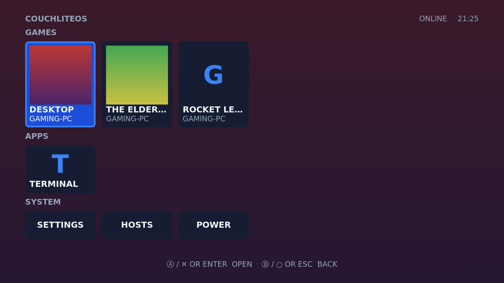
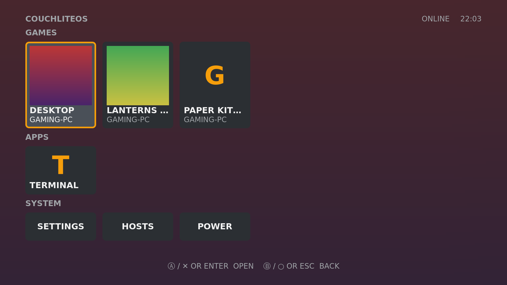
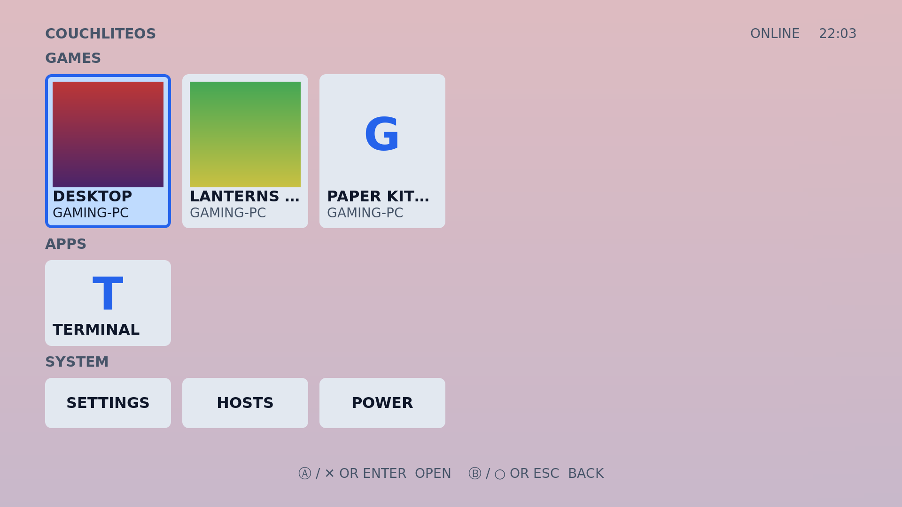
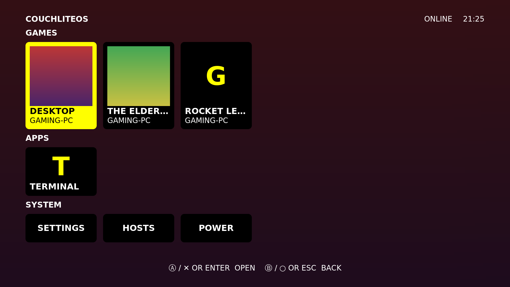

# Themes

**Settings > APPEARANCE** changes the colours of the whole box: the TV home
screen, the Settings screens, the quick menu and the on-screen keyboard. A change
shows at once; nothing restarts.

| Row | Does |
|---|---|
| THEME | Picks a theme: one of the fourteen built in, or one of your own (below) |
| ACCENT | THEME DEFAULT, or BLUE, AMBER, GREEN, RED, PURPLE, PINK, TEAL or ORANGE in place of the theme's own accent colour, or BY MONTH (below) |
| BACKGROUND | What the TV home screen draws behind its menu: WAVE AND SPARKLES (the default), WAVE (no sparkles) or PLAIN (the theme's colours alone, nothing moving) |
| SOUNDS | The navigation sounds ON or OFF |
| ARTWORK | Cover lookup for games |

## Built-in themes

| Theme | Looks like |
|---|---|
| MIDNIGHT | The default: dark blue-black with a blue accent |
| SLATE | Dark grey with an amber accent |
| DAYLIGHT | Light background with dark text, for a bright room |
| HIGH CONTRAST | Black and white with a yellow focus; text on the focus is black |
| TERMINAL | The look before 0.3.0: white text on black, the selection in reverse video |
| OCEAN | Deep sea blue with a bright cyan accent |
| CRIMSON | Near black with a red tint and a crimson accent |
| EMERALD | Dark green with a green accent |
| AMETHYST | Dark violet with a purple accent |
| SUNSET | Burnt orange dusk with an orange accent |
| ROSE | Dark plum with a pink accent |
| GOLD | Olive black with a gold accent |
| GRAPHITE | Neutral dark grey with a silver accent |
| ARCTIC | A second light theme: icy white and pale cyan with a teal accent |

### BY MONTH

Like the PS3, the background can change colour through the year: ACCENT >
BY MONTH takes a colour for each month (grey in January, then dull yellow, lime
green, pink, dark green, light purple, teal, blue, purple, gold, brown and red in
December). It moves to the month's colour about halfway through: from the 12th
to the 14th last month's colour blends into it, and from the 15th it is this
month's. It works with every theme, tints the wave on the home screen (darker at
night) and colours the focused tile's edge and the values in Settings. A
running TV picks up the new colour on its own.

| MIDNIGHT | SLATE |
|---|---|
|  |  |
| **DAYLIGHT** | **HIGH CONTRAST** |
|  |  |

## Make your own theme

A theme is a small text file whose name ends in `.theme`. Put it in

```
/var/lib/couchliteos/home/.config/couchliteos/themes/
```

on the box, then open Settings > APPEARANCE > THEME: it is in the list. The
easiest start is a copy of a built-in theme. In the **TERMINAL** app:

```bash
mkdir -p /var/lib/couchliteos/home/.config/couchliteos/themes
cd /var/lib/couchliteos/home/.config/couchliteos/themes
cp /usr/share/couchliteos/themes/midnight.theme my-theme.theme
```

Then change the colours in `my-theme.theme`, or write the file on another
computer and copy it into that folder.

### The file

```ini
# My theme. Lines starting with # are comments.
[theme]
name = MY THEME
background = #0b1020
surface = #161d33
text = #f1f5f9
muted = #94a3b8
accent = #3b82f6
focus = #1d4ed8
warning = #fbbf24
error = #f87171
wallpaper = /var/lib/couchliteos/home/Pictures/wallpaper.png
```

The file needs a `[theme]` line and all eight colours. `name` and `wallpaper`
are optional.

| Key | What it colours |
|---|---|
| `background` | The screen behind everything |
| `surface` | Tiles and panels (game and app tiles, the quick menu, the Settings help pane) |
| `text` | Normal text |
| `muted` | Row titles, details under a tile, help text, the button hints along the bottom |
| `accent` | The border of the focused tile, the large letter on tiles without a cover, the edge of the quick menu, progress bars and values in Settings. The ACCENT setting replaces this colour. |
| `focus` | The fill of the focused tile or row |
| `warning` | Warnings |
| `error` | Error messages |
| `name` | The name in the THEME list (shown in capitals). Without it, the file name is used. |
| `wallpaper` | A picture behind the screens, dimmed. It must be a full path starting with `/`. On the home screen the focused game's cover is shown instead when it has one. |

Rules:

- **Colours** are six hex digits, `#rrggbb` (`#1d4ed8`) or without the `#`.
  Names such as `blue` and short forms such as `#fff` do not work.
- **The file name** (the part before `.theme`) uses only lower-case letters,
  digits and `-`, starts with a letter or digit, and is at most 32 characters:
  `my-theme.theme` works, `My Theme.theme` does not. Each key may appear once.
- **The file** must be smaller than 4 KB.
- A file that breaks a rule is left out of the list as a whole, never used
  halfway. Settings > APPEARANCE then names the file and the reason on its
  bottom line (for example `SKIPPED MY-THEME.THEME: MISSING FOCUS`).
- A file with the same file name as a built-in theme (`midnight.theme`) is left
  out too; give yours its own name.
- If the chosen theme is deleted or broken later, the box goes back to
  MIDNIGHT.
- After you edit the theme that is in use, choose it again in THEME to see
  the change.

### Readable on a TV

Text is read from a few metres away, so keep a strong difference between
`text` and `background`, and between `text` and `focus`. If `text` is hard to
read on your `focus` colour, the box draws the focused text in your
`background` colour instead (this is how HIGH CONTRAST gets black text on
yellow). A light theme works like DAYLIGHT: a light `background` and `surface`,
a dark `text`.

### Going back

Pick another theme in Settings > APPEARANCE > THEME, or delete your file. To
put the default colours back, choose MIDNIGHT and set ACCENT to THEME DEFAULT.
